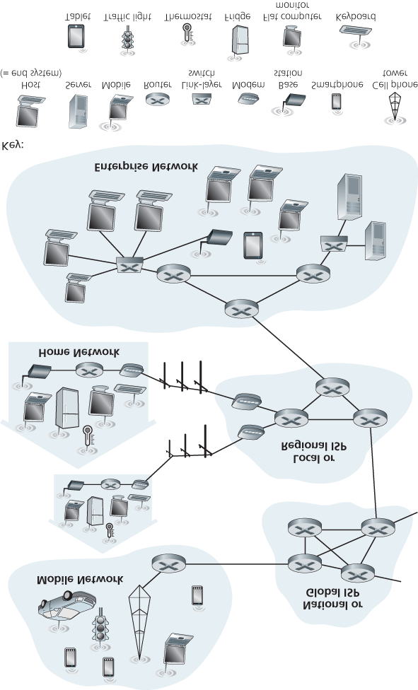

# Network Fundamentals Notes

My notes for Network Fundamentals.

# Chapter 1

### Road Map

* 1.1 what *is* the Internet?
* 1.2 network edge
  * end systems, access networks, links
* network core
  * packet switch, circuit switch, network structure
* 1.5 operations: protocol layers, service models
* ~~1.6 networks under attack: security~~
* 1.7 history

## 1.1 What is the Internet?

The textbook uses the public Internet (a speciic computer network) as their principle vehicle for discussing computer networks and their protocols. The internet can be described in two ways:
* The basic hardware and software components that make up the Internet
* A networking infrastructure that provides services to distributed applications

### 1.1.1 A "Nuts and bolts" Description

The Internet is a computer network that interconnects billions of computing devices throughout the world. Not too long ago, these com

* Billions of connected computing devices
  * hosts = end systems
  * running network apps
* Communications links
  * fiber, copper, radio, satellite
  transmission rate: bandwidth
* packet switches: forward packets (chunks of data)
  * routers and switches
  

