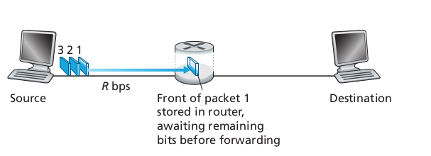

# Network Fundamentals Notes

My notes for Network Fundamentals from Computer Networking: A Top-Down Approach.

# Chapter 1

### Road Map

* [1.1 what is the Internet?](#1.1)
* [1.2 network edge](#1.2)
  * end systems, access networks, links
* [1.3 network core](#1.3)
  * packet switch, circuit switch, network structure
* [1.4 delay, loss, throughput in networks](#1.4)
* [1.5 operations](#1.5): protocol layers, service models
* ~~1.6 networks under attack: security~~
* [1.7 history](#1.7)

##  1.1 What is the Internet?

The textbook uses the public Internet (a specific computer network) as their principle vehicle for discussing computer networks and their protocols. The internet can be described in two ways:
* The basic hardware and software components that make up the Internet
* A networking infrastructure that provides services to distributed applications

### 1.1.1 A "Nuts and bolts" Description

* Billions of connected computing devices
  * hosts = end systems
  * running network apps
* Communications links
  * fiber, copper, radio, satellite
  transmission rate: bandwidth
* packet switches: forward packets (chunks of data)
  * routers and switches

#### Hosts/End Systems

The Internet is a computer network that interconnects billions of computing devices throughout the world. These include traditional devices such as desktop PCs, Linux workstations and servers, as well as newer 'nontraditional' devices such as laptop, smartphones, tablets, TVs, gaming console, thermostas, home security systems, cars etc. In Internet jargon, all of these devices are called **hosts** or **end systems**. 

*Figure 1.1*

#### Communications Links

End systems are connected together by a network for communication links and packet switches.

[Section 1.2](#1.2) covers more about communication links, which are made up different types of physical media, including coaxial cable, copper wire, optical fibre, and radio spectrum.

#### Transmission rate

Different links can transmit at different data rates, with the **transmission rate** of a link measured in bits/second.
  
#### Packet Switches
  
When one end system has data to send to another end system, the sending end system segments the data and adds header bytes to each segment. The resulting packes of information, known as **packets**, are then sent through the network to the destination end system, where they are ressambled into the original data.

A **packet switch** takes a packet arriving on one of its incoming communication links and forwards that packet on one of its outgoing communication links.

The two most prominent types of packet switches are **routers** and **link-layer switches**. Both types of switches forward packets toward their ultimate destinations. Link-layer switches are typically used in access networks, while routers are typucalled used in the network core.

The sequence of communication links and packet switches traversed by a packet from the sending end system to the receiving end system is known as a **route** or **path** thrhough the network.

End systems access the Internet through **Internet Service Providers (ISPs)**, such as residential ISPs, corporate ISPs, university ISPs and cellular data ISPs. Each ISP is in itself a network of packet switches and communication links.

End systems, packet switches and other pieces of the Internet run **protocols** that control the sending and receiving of information within the Internet. The **Transmission Control Protocol (TCP)** and the **Internet Protocol (IP)** are two of the most important protocols in the Internet. The IP protocol specifies the format of the packets that are sent and received among routers and end systems. The Internet's principal protocols are collectively known as **TCP/IP**.

### 1.1.2 A Services Description

* **Internet**: "network of networks"
  * mobile networks
  * home networks
  * institutional networks
  * Interconnected ISPs
* **protocols** control sending, receiving of messages
  * e.g. TCP, IP, HTTP, 802.11
* **Internet standards**
  * RFC: Request for comments
  * IETF: Internet Engineering Task Force

#### Protocols

A protocol defines the format and the order of messages exchanged between two or more communicating entities, as well as the actions taken on the transmission and/or receipt of a message or other event.

A network protocol is similar to a human protocol (e.g. Person A asks for the time and Person B replies with the correct time), except that the entities exchanging messages and takign actions are hardware or software components.

#### Internet Standards

Given the importance of protocols to the Internet, it’s important that everyone agree on what each and every protocol does, so that people can create systems and products that interoperate. This is where standards come into play. **Internet standards** are developed by the **Internet Engineering Task Force (IETF)**.

The IETF standards documents are called **requests for comments (RFCs)**. RFCs started out as general requests for comments (hence the name) to resolve network and protocol design problems that faced the precursor to the Internet. RFCs tend to be quite technical and detailed. They define protocols such as TCP, IP, HTTP (for the Web), and SMTP (for e-mail). There are currently more than 7,000 RFCs.

Other bodies also specify standards for network components, most notably for network links. The IEEE 802 LAN/MAN Standards Committee, for example, specifies the Ethernet and wireless WiFi standards.

##  1.2 The Network Edge

The **network edge** refers to the **end systems** of a network. They are called end systems because they they sit at the edge of the Internet. This includes deskstop, laptops, smartphones, servers and mobile devices.

End systems are also referred to as *hosts* because they host (run) application programs such as a Web browser program, a Web server program, an e-mail client programin and so on.

`hosts` = `end system`

Hosts can also be divided further into **clients** and **servers**.

**Clients** tend to be desktop and mobile PCs, smartphones, etc.

**Servers** tend to be more powerful machines that store and distribute Web pages.

### 1.2.1 Access Networks

An **access network** is the network that physically connects and end system to the first router (aka the "edge router) on a path from the end system to any other distant end system.

#### Home Access: DSL, Cable, FTTH, Dial-Up, and Satellite

Today, the two most prevalent types of broadband residential access are **digital subscriber line (DSL)** and cable.

A residence typically obtains DSL Internet access from the same local telephone company (telco) that provides its wired local phone access. Thus, when DSL is used, a customer’s telco is also its ISP.

The residential telephone line carries both data and traditional telephone signals simultaneously, which are encoded at different frequencies:

* A high-speed downstream channel, in the 50 kHz to 1 MHz band
* A medium-speed upstream channel, in the 4 kHz to 50 kHz band
* An ordinary two-way telephone channel, in the 0 to 4 kHz band

# TODO FINISH 1.2.1

## The network core

The **network core** are the mesh of packet switches and links that interconnects the Internet's end systems.

### 1.3.1 Packet Switching

When sending files/messages to other end systems, they break up the messages into smaller chunks of data known as **packets**.

Between the source and the destination, each packet travels through communication links and **packet switches**.

The two main types of **packet switches**:

* **routers**
* **link-layer switches**

Packets are transmitted over each communication link at a rate equal to the *full* transmission rate of the link. So, if a source end system or a packet siwtch is sending a packet if *L* bits over a link with transmisison rate *R* bits/sec, then the time to transmit the packet is *L / R* seconds.

#### Store-and-Forward Transmission

Most packet switches use **store-and-forward transmission** at the inputs to the links. This means that the packet switch must receive the entire packet before it can begin to transmit the first bit of the packet onto the outbound link.

Routers which employ this method cannot transmit the bits it has received; instead it must first buffer (i.e., “store”) the packet’s bits. Only after the router has received all of the packet’s bits can it begin to transmit (i.e., “forward”) the packet onto the outbound link.

To calculate **end-to-end delay** this formula is used:

**Example**

*L* = 1200 bytes * 8bit/byte = 9600 bits

*R* = 3 Mbps = 3,000,000 bps

*L/R* = 0.0032 seconds = 3.2 ms 

one-hop transmission delay = 3.2 ms

##### Queueing delay, loss

Store-and-forward transmission is useful because if a burst of packets arrive faster than the router can process them, instead of dropping those packets, they can be queued in memory. 

If the arrival rate (in bits) to link exceeds transmission rate of link for a period of time
* packets will queue and wait to be transitted on link
* packets can still be dropped (lost) if the router's memory (buffer) fills up

# TODO FINISH UP TO 1.4

## 1.4 Performance delay, loss, throughput

### 1.4.3 End-to-End Delay

#### Four sources of packet delay

`d_total = d_proc + d_queue + d_trans + d_prop`

`d_proc`: nodal processing

* Check bit errors
* Determine output link
* Typically ~ msec

`d_queue`: queueing delay

* Time eating at output link for transmission
* Depeds on congestion level of router

`d_trans`: transmission delay

* *L*: packet length (bits)
* *R*: link bandwidth (bps)
* `d_trans` = *L/R*

`d_prop`: propagation delay

* *d*: length of physical link'
* *s*: propagation speed (~2x10^8 m/sec)
* `d_prop` = *d/s*

#### Textbook Explanation

End-to-end delay considers the total delay from source to destination (before we have only been discussing nodal delay - the delay at a single router).

Suppose there are *N* - 1 routers between the source host and the destination host, and that there is no queueing delay (the network is uncongested).

The **total end-to-end delay** would be calculated like this:

## 1.5 Operations: protocol layers, service models

### Protocol Layering

Each protocol belongs to a layer. A layer implements a service:

* via its own internal-layer actions
* relying on service provided in layers beneath it

#### Internet protocol stack

The Internet protocol stack consists of 5 layers

1. **physical:** bits "on the wire"
2. **datalink:** data transfer between neighbouring network elements
    * Ethernet, 802.11 (WiFi)
3. **network:** routing of datagrams from source to destination
    * IP, routing protocols
4. **transport:** process-process data transfer
    * TCP, UDP
5. **application:** supporting network applications
    * SMTP(email), HTTP(web)

## 1.7 History

### 1961-1972: Early packet-switching principles

* 1961: Kleinrock -- queueing theory shows effeciveness of packet-switching
* 1964: Baran -- packet-switching in military nets
* 1967: ARPAnet converived by Advanced Research Projects Agency
* 1969: first ARPAnet node operational
* 1972:
    * ARPAnet pblic demo
    * NCP(Network Control Protocol) first host-host protocol
    * first e-mail program
    * ARPAnet has 15 nodes

### 1972-1980: Internetworking, new and proprietary nets

* 1970: ALOHAnet satellite network in Hawaii
* 1974: Cerf and Kahn -- architecture for interconnecting networks
* 1976: Ethernet at Xerox PARC
* Late 70's: proprietary architectures: DECnet, SNA, XNA
    * switching fixed length packets (ATM precursor)
* 1979: ARPAnet has 200 nodes

> Cerf and Khan's internetworking principles
> * minimalism, autonomy -- no internal changes required to interconnect networks
> * best effort service model
> * stateless routers
> * decentralized control

### 1980-1990: new protocols, a proliferation of networks

* 1982: smtp e-mail protocol defined
* 1983: deployment of TCP/IP
* 1983: DNS defined for name-to-IP-address translation
* 1985: ftp protocol defined
* 1988: TCP congestion control
* new national networks: CSnet, BITnet, NSFnet, Minitel
* 100,000 hosts connected to confederation of networks

### 1990 - 2000's: commercialization, the Wen, new apps

* early 1990's: ARPAnet decommissioned
* 1991: NSF lifts restrictions on commercial use of NSFnet (decommissioned, 1995)
* early 1990s: Web
    * hypertext [Bush 1945, Nelson 1960's]
    * HTML, HTTP: Berners-Lee
    * 1994: Mosaic, later Netscape
    * late 1990's: commercialization of the Web
* late 1990's - 2000's
    * more killer apps:
        * instant messaging
        * P2P file sharing
    * network secuirty to forefront
    * est. 50 million host, 100 million+ users
    * backbone links running at Gbps

### 2005 - present

* ~5b devices attached to Internet (2016)
     * smartphones and tablets
* aggressive deployment of broadband access
* increasing ubiquity of high-speed wireless access
* emergence of online social networks:
    * Facebook: ~ one billion users
* service providers (Google, Microsoft) create their own networks
    * bypass Internet, providing "instantaneous" access to search, video content, email, etc
* e-commerce, universities, enterprises running their services in the "cloud" (e.g. Amazon EC2)

### NBN Acess Technologies

* FTTH, FTTB: 100Mbps, up to 600Mbps
* FTTC, FTTN (DSL to home): 40-100Mbps
* HFC: 50-100 Mbps (shared_
* DSL: 2-20 Mbps
* WiFi: 5-50Mbps (shared)
* 4G: 1-10Mbps
* Satellite: 5-25 Mbps (long delay, shared)

### ISP

* Tier 1
    * Telstra
    * Optus
    * Vodafone(mobile)
* Tier 2
    * TPG, iiNet, Dodo, Pivit, iPrimus, Foxtel (content)
