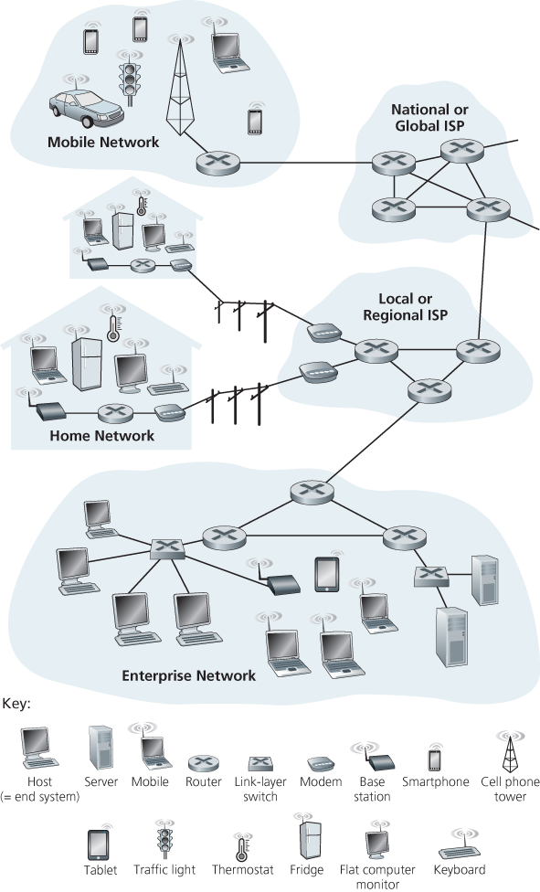

# Network Fundamentals Notes

My notes for Network Fundamentals.

# Chapter 1

### Road Map

* [1.1 what is the Internet?](#1.1-what-is-the-internet?)
* 1.2 network edge
  * end systems, access networks, links
* network core
  * packet switch, circuit switch, network structure
* 1.5 operations: protocol layers, service models
* ~~1.6 networks under attack: security~~
* 1.7 history

## 1.1 What is the Internet?

The textbook uses the public Internet (a speciic computer network) as their principle vehicle for discussing computer networks and their protocols. The internet can be described in two ways:
* The basic hardware and software components that make up the Internet
* A networking infrastructure that provides services to distributed applications

### 1.1.1 A "Nuts and bolts" Description

* Billions of connected computing devices
  * hosts = end systems
  * running network apps
* Communications links
  * fiber, copper, radio, satellite
  transmission rate: bandwidth
* packet switches: forward packets (chunks of data)
  * routers and switches

#### Hosts/End Systems

The Internet is a computer network that interconnects billions of computing devices throughout the world. These include traditional devices such as desktop PCs, Linux workstations and servers, as well as newer 'nontraditional' devices such as laptop, smartphones, tablets, TVs, gaming console, thermostas, home security systems, cars etc. In Internet jargon, all of these devices are called **hosts** or **end systems**. 

*Figure 1.1*

#### Communications Links

End systems are connected together by a network for communication links and packet switches.

[Section 1.2](#1.2) covers more about communication links, which are made up different types of physical media, including coaxial cable, copper wire, optical fibre, and radio spectrum.

#### Transmission rate

Different links can transmit at different data rates, with the **transmission rate** of a link measured in bits/second.
  
#### Packet Switches
  
When one end system has data to send to another end system, the sending end system segments the data and adds header bytes to each segment. The resulting packes of information, known as **packets**, are then sent through the network to the destination end system, where they are ressambled into the original data.

##  1.2 The Network Edge
